## 计算机毕业设计Python深度学习水文预测 水文可视化 水文爬虫 洪水自然灾害预测 水文数据分析 水文大数据 大数据毕业设计 机器学习 Hadoop Spark 卷积神经网络 时间序列预测模型

## 要求
### 源码有偿！一套(论文 PPT 源码+sql脚本+教程)

### 
### 加好友前帮忙start一下，并备注github有偿纯python水文预测可视化
### 我的QQ号是2827724252或者798059319或者 1679232425或者微信:bysj2023nb 或bysj1688

# 

### 加qq好友说明（被部分 网友整得心力交瘁）：
    1.加好友务必按照格式备注
    2.避免浪费各自的时间！
    3.当“客服”不容易，repo 主是体面人，不爆粗，性格好，文明人。
	
### 论文
一、项目简介
本项目旨在构建一套水文数据管理与预测系统，针对水文学领域的研究和实际应用需求。基于Python编程语言及相关技术，包括Flask框架、PyMySQL数据库连接工具、Echarts数据可视化库以及机器学习模块，我们成功打造了这一系统。通过Python及Flask框架搭建强大的Web服务器端应用程序，实现了水文数据的存储、管理、可视化和预测。
系统提供了丰富的功能，包括数据获取、数据管理、数据可视化和数据预测。使用Flask和PyMySQL，我们能够轻松连接和管理水文数据，确保数据的安全性和完整性。同时，通过Echarts库实现了水文数据的多维度可视化展示，帮助用户直观地了解水文数据的变化趋势。采用机器学习模型，如决策回归树模型，我们实现了对水文数据的预测功能，为未来的水文状况提供预测和参考依据。
然而，虽然系统已经具备了多项强大功能，仍存在改进空间。目前，我们仅选择了长江水文网作为主要数据源，未能覆盖更多的水文数据来源。系统的数据可视化功能还有提升的余地，尤其在数据分析和交互性方面。另外，水文数据预测功能尚可进一步改进，引入更先进的机器学习技术，提高预测的准确性和鲁棒性。
总体而言，本项目是一个涉及多项关键技术的水文数据处理与分析系统，虽然在功能和技术上已取得成就，但我们看到了进一步优化和扩展的潜力。未来，我们将不断完善数据源、提升数据可视化功能，并探索更先进的数据预测方法，以满足用户对水文数据处理与预测的更高需求，为水文学领域的研究和实践提供更为精确和有效的支持。

二、开发环境
开发环境	版本/工具
PYTHON	3.6.8
开发工具	PyCharm
操作系统	Windows 10
内存要求	8GB 以上
浏览器	Firefox (推荐)、Google Chrome (推荐)、Edge
数据库	MySQL 8.0 (推荐)
数据库工具	Navicat Premium 15 (推荐)
项目框架	FLASK
三、项目技术
后端：Flask、PyMySQL、MySQL、urllib
前端：Jinja2、Jquery、Ajax、layui

四、功能结构
系统功能设计是指根据系统需求分析，对系统进行具体功能的设计和实现。在本系统中，主要包括数据分析功能、用户模块、公告模块、水文数据管理、水文数据采集五个部分。其功能结构图下图所示。

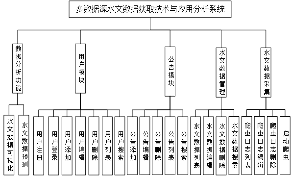

#数据分析功能是系统的核心功能之一，包括水文数据可视化和水文数据预测两部分。水文数据可视化是指将大量的水文数据进行可视化展示，以便用户可以更直观、更方便地了解数据。水文数据预测则是通过分析历史水文数据，预测未来一段时间内的水文变化趋势，为决策提供参考依据。
用户模块包括用户登录、注册、列表、修改、添加、删除和搜索七个功能，为用户提供了一个完整的个人信息管理平台。用户登录和注册是用户使用系统的入口，用户列表则展示了系统中所有用户的信息。用户可以修改自己的个人信息，也可以添加和删除自己的数据。此外，还提供了搜索功能，用户可以快速查找需要的信息。
公告模块包括公告列表、添加、删除、修改、搜索五个功能。管理员可以在公告列表中添加公告，也可以对已有的公告进行修改和删除。用户可以通过搜索功能查找自己所需要的公告信息。
水文数据管理模块包括数据列表、修改、删除、搜索四个功能。管理员可以对系统中所有的水文数据进行管理，可以对数据进行修改和删除，也可以通过搜索功能查找需要的数据。
水文数据采集包括爬虫日志列表、爬虫日志编辑、爬虫日志删除以及启动爬虫等功能。该模块是整个系统的数据采集和处理核心，管理员可以通过爬虫日志列表查看系统的爬虫状态和日志信息，也可以编辑和删除日志信息，以及启动爬虫任务。

### 演示视频
https://www.bilibili.com/video/BV1Cb421n7U7/?spm_id_from=333.999.0.0

### 运行截图

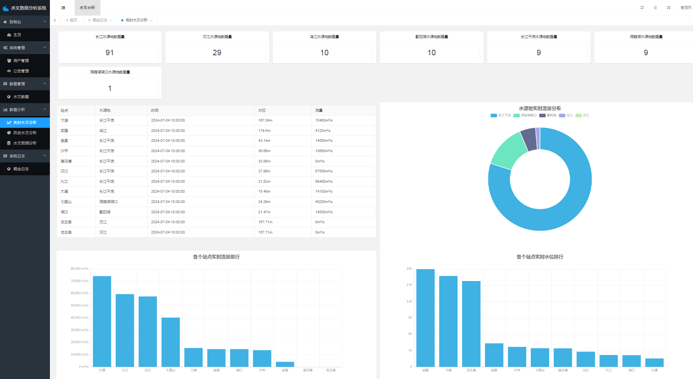
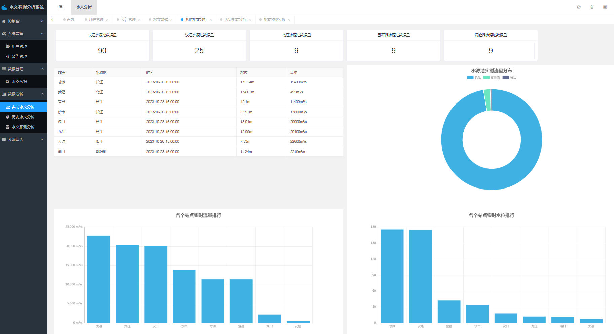
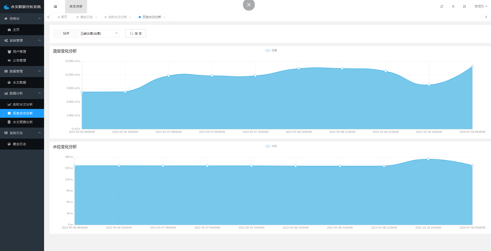
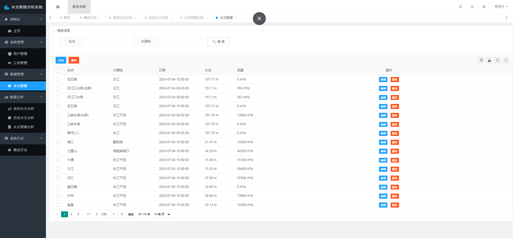

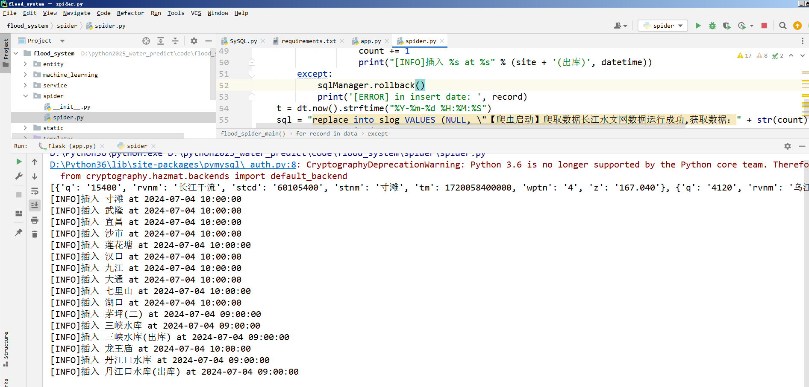
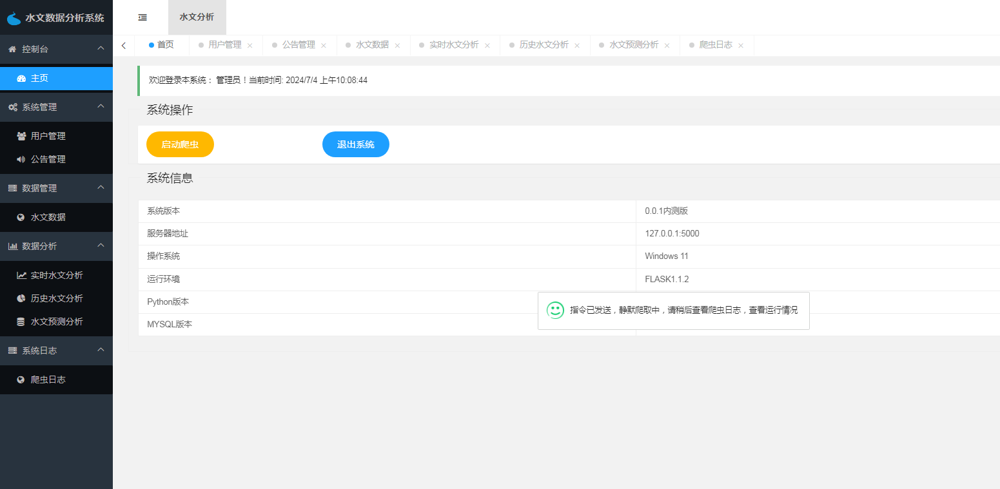
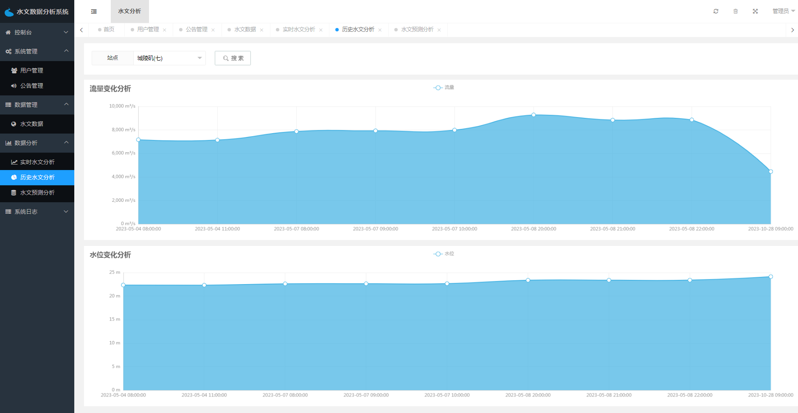
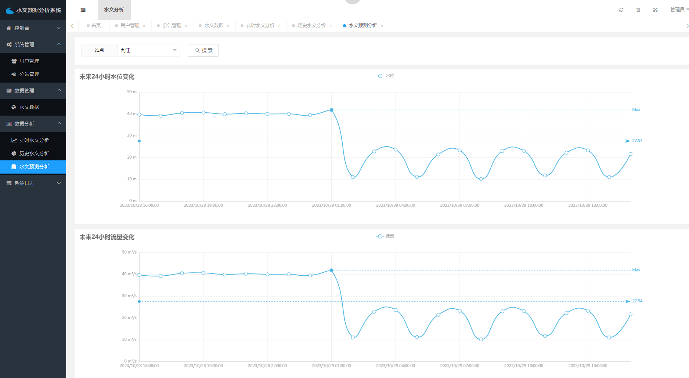
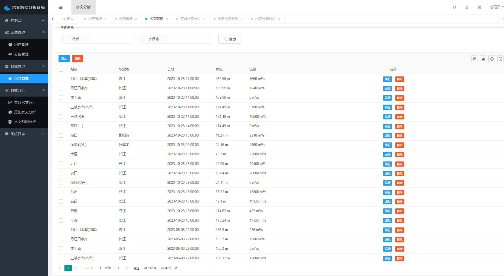
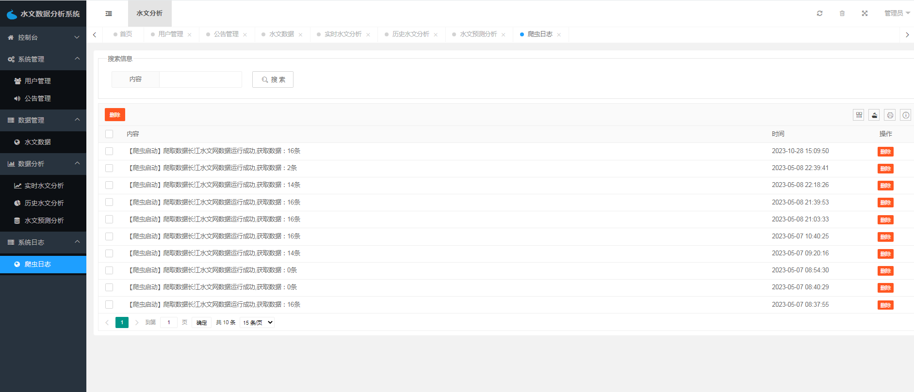
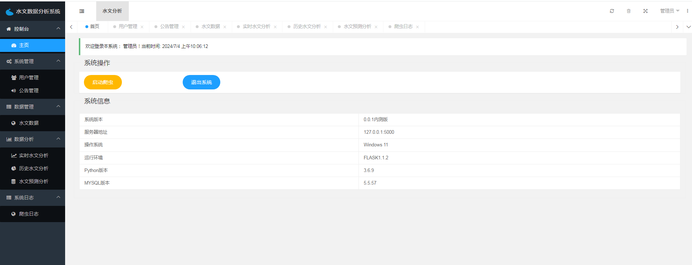
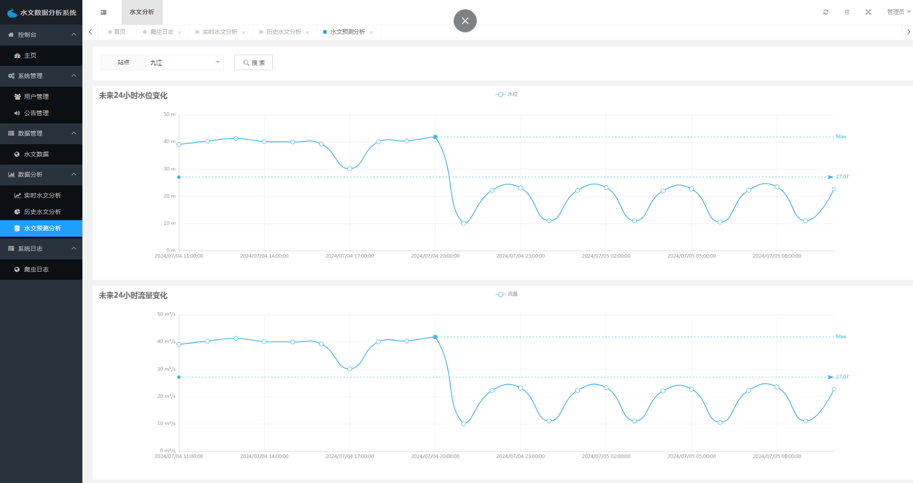

### 附：论文
多数据源水文数据获取技术与应用分析

摘 要

随着信息技术的不断发展，水文数据获取和分析成为了现代水文学研究的重要内 容。多数据源水文数据获取技术与应用分析系统为我们提供了一种新的水文数据处理和 分析方式。该系统利用爬虫技术获取长江水文网的数据，采用 Python 编程语言和 MySQL 数据库进行数据处理和管理，同时使用Echarts 和 Scikit-learn 库进行数据可视化和 机器学习预测分析，最终通过 Flask 构建的数据接口服务层将数据和分析结果提供给其 他应用程序调用和使用。
该系统的主要模块包括用户登陆注册模块、水文数据管理模块、水文数据可视化模 块、水文数据预测模块以及公告模块。这些模块可以为用户提供完整的水文数据管理和 使用服务，包括数据的查询、添加、修改和删除等操作，数据的可视化和分析，以及基 于历史数据建立预测模型，预测未来水文情况等。
该系统的实现为水文学研究和水资源管理提供了新的途径和思路。通过该系统，可 以更加方便地获取和分析水文数据，为水文学研究和水资源管理提供更加精确的数据支 持和决策依据。同时，该系统的可扩展性和可维护性也为未来的需求和变化提供了更好 的适应性。
总之，多数据源水文数据获取技术与应用分析系统是水文学研究和水资源管理的重 要工具和手段，为我们提供了更加便捷、高效和精确的数据处理和分析方式。随着信息 技术的不断发展，该系统还有着广泛的应用前景和发展空间，将为水文学研究和水资源 管理带来更多的创新和变革。
关键词：水文数据，Flask，Scikit-learn，mysql，可视化

                                    

Implementation and Application of Hydrological Data Visualization Technology

ABSTRACT

With   the   continuous   development   of    information   technology,   hydrological   data acquisition and analysis have become important contents of modern hydrological research. The system  of  multi-data  source  hydrological  data  acquisition  technology  and  application analysis provides us with a new way of hydrological data processing and analysis. This system uses  spider  technology  to  obtain  data  from  the  Yangtze  River  Hydrology  Network,  uses Python programming language and MySQL database for data processing and management, and  uses  Echarts  and  Scikit-learn  libraries  for   data  visualization   and  machine  learning prediction analysis. Finally, through the data interface service layer constructed by Flask, data and analysis results are provided for other application programs to call and use.
The   main   modules   of   the   system    include   user    login   and   registration    module, hydrological data management module, hydrological data visualization module, hydrological data prediction module, and announcement module. These modules can provide users with complete hydrological data management and use services, including operations such as data querying, adding, modifying, and deleting, data visualization and analysis, and establishing predictive models based on historical data to predict future hydrological conditions.
The implementation of this system provides a new approach and idea for hydrological research and water resources management. Through this system, hydrological data can be more  conveniently  obtained  and  analyzed,  providing  more  accurate  data  support  and decision-making  basis for  hydrological  research  and  water  resources  management.  At the same time, the scalability and maintainability of the system also provide better adaptability to future needs and changes.
In summary, the system of multi-data source hydrological data acquisition technology and application analysis is an important tool and means for hydrological research and water resources  management,  providing  us  with  more  convenient,  efficient,  and  accurate  data processing   and   analysis   methods.   With   the   continuous   development   of   information technology, this system also has broad application prospects and development space, which will  bring  more  innovation  and  changes  to   hydrological   research  and  water   resources management.

KEY WORDS: Hydrological data, Flask, Scikit-learn, mysql, visualization

                                                            

目 录

摘 要 	 II
ABSTRACT 	III
1 系统分析 	1
1.1 开发背景 	1
1.2 目的和要求 	1
1.3 可行性研究 	7
2 开发技术及开发环境 	3
2.1 Java 语言简介 	 
2.2 J2EE 技术介绍 	 
2.3 Servlet/JSP 技术 	
2.4 MVC 简介 	 
2.5 Struts 技术 ······························································
2.6 Hibernate 技术 · · · · · · · · · · · · · · · · · · · · · · · · · · · · · · · · · · · · · · · · · · · · · · · · · · · · · · · · · 
2.6.1 应用程序的分层体系结构 ·····································
2.6.2 Hibernate 的应用及 API 简介 · · · · · · · · · · · · · · · · · · · · · · · · · · · · · · · 
2.7 开发环境及环境配置 ··················································· 
2.7.1 Java/JSP 系统环境 ·············································
2.7.2 JSP 环境的安装和环境变量的设置 	 
2.7.3 Eclipse 开发工具 	 
2.7.4 Tomcat 服务器 	 
2.8 数据库开发工具选择及配置 	
3 系统需求分析及设计 	5
3.1 系统需求分析 	 
3.1.1 系统功能需求 	
3.1.2 系统界面要求 	
3.2 概要设计 	5
3.2.1 系统体系结构设计 	
3.2.2 系统功能模块设计 	
3.2.3 功能设计的目标与原则 	
3.3 数据库设计 	 9
3.3.1 数据库需求分析 	
3.3.2 数据库概念结构设计 	11

                                                            

3.3.3 数据库逻辑表设计 ··············································
3.3.4 数据库逻辑结构设计 ···········································
3.4 数据库访问设计 · · · · · · · · · · · · · · · · · · · · · · · · · · · · · · · · · · · · · · · · · · · · · · · · · · · · · · · · · 
3.4.1 数据库表模型设计 ··············································
3.4.2 Hibernate 数据库访问配置 · · · · · · · · · · · · · · · · · · · · · · · · · · · · · · · · · · 
3.4.3 定义映射文件 ····················································
3.4.4 Hibernate Session 工厂 · · · · · · · · · · · · · · · · · · · · · · · · · · · · · · · · · · · · · 
3.4.5 定义和实现 Hibernate DAO · · · · · · · · · · · · · · · · · · · · · · · · · · · · · · · · · · 
3.4.6 Hibernate Filter 的实现 ····································
4 系统功能模块的实现 · · · · · · · · · · · · · · · · · · · · · · · · · · · · · · · · · · · · · · · · · · · · · · · · · · · · · · · · · · · 
4.1 系统主页设计 · · · · · · · · · · · · · · · · · · · · · · · · · · · · · · · · · · · · · · · · · · · · · · · · · · · · · · · · · · · · 
4.1.1 主页显示设计 ····················································
4.1.2 主页后台设计 ····················································
4.2 系统登录功能设计 ······················································ 
4.3 系统搜索功能设计 ······················································ 
4.4 用户注册功能设计 ······················································ 
4.4.1 用户注册页面设计 ··············································
4.4.2 用户注册后台设计 ··············································
4.5 发布、修改信息设计 ··················································· 
4.6 信息管理设计 	
4.7 信息留言设计 	 
4.8 二手指南设计 	 
5 总结 	 
致 谢 	 14
参 考 文 献 	 38
附 录 	 

                                                            

1 引言

引言包括研究背景、研究目的、国内外研究等内容，通常从背景入手，引出 研究问题，然后简要介绍研究目的和国内外研究现状，突出文章的创新性和重要 性。
1.1 研究背景

随着信息技术的不断发展和水资源管理的重要性日益凸显，水文数据获取和 分析成为了现代水文学研究和水资源管理的重要内容。随着水文数据获取方式和 数据量的不断增加，如何快速、准确地处理和分析水文数据，成为了水文学研究 和水资源管理中的重要问题。
传统的水文数据处理和分析方法存在着很多问题，如数据来源单一、数据量 有限、处理速度慢等，难以满足当今水资源管理和水文学研究的需求。因此，我 们需要一种新的水文数据处理和分析方式，以更好地满足当前水文学研究和水资 源管理的需求。
随着互联网技术和大数据技术的快速发展，我们可以通过爬虫技术获取互联 网上的水文数据，并采用数据挖掘和机器学习等方法进行数据处理和分析，以快 速、准确地获得水文数据的各种信息。这为水文学研究和水资源管理提供了新的 途径和思路。
1.2 研究目的

本项目的研究目的是开发一种多数据源水文数据获取技术与应用分析系统， 为水文学研究和水资源管理提供更加便捷、高效和精确的数据处理和分析方式。 随着信息技术的不断发展，水文数据获取和分析成为了现代水文学研究的重要内 容，然而，目前国内外大多数水文数据处理和分析工作仍然依赖传统的手动采集 和处理方式，效率低下、成本高昂、易受到人为因素的干扰等问题仍然存在。
因此，本项目旨在利用现代信息技术，结合爬虫技术、Python编程语言、MySQL 数据库、Echarts和Scikit-learn库等工具，构建一种全面、高效、可扩展和易 维护的水文数据获取和分析系统，通过该系统实现水文数据的自动化采集、统计、 分析和预测，提高水文数据处理和分析的效率和准确度，为水文学研究和水资源 管理提供更好的数据支持和决策依据。
同时，本项目还旨在探索水文数据可视化技术的实现和应用，将水文数据以 可视化的形式呈现，为用户提供更加直观、易懂的数据分析结果，提高数据处理 和分析的效果和可靠性。综上所述，本项目的研究目的是为水文学研究和水资源

                                                            

管理提供一种全新的水文数据处理和分析方式，以更好地满足水资源管理的需求 和发展。
1.3 国内外研究

近年来，水文数据的可视化技术逐渐受到关注和重视，不仅是因为其对水文 学研究和水资源管理的重要性，还因为随着信息技术的发展，可视化技术在数据 处理和分析方面的应用日益普及。国内外许多研究机构和学者都在开展相关研究 工作，提出了不同的可视化方法和技术，为水文学研究和水资源管理提供了更加 便捷、高效和精确的数据处理和分析方式。
在国外，水文数据可视化技术的研究和应用已经有了一定的成果和经验。例 如，美国国家气象局（NOAA）和国家水文中心（NHC）等机构在风暴潮、洪水、 旱灾等水文灾害方面的可视化技术应用中，采用了基于GIS技术的多维数据可视 化和实时数据监测方法。此外，还有一些研究利用虚拟现实技术和可穿戴设备等 手段，将水文数据可视化成3D图像，为用户提供更加直观、形象的数据展示和分 析。
在国内，水文数据可视化技术的研究和应用也呈现出了快速发展的态势。例 如，中国水利部水文局在水文数据处理和分析方面，采用了基于Python语言的数 据挖掘和可视化技术，构建了水文数据可视化和应用平台，实现了水文数据的可 视化、分析和预测功能。此外，国内一些高校和研究机构也在水文数据可视化领 域积极探索和实践，提出了不同的可视化方法和技术，并取得了一些成果。
总之，水文数据可视化技术的研究和应用已经成为了国内外研究机构和学者 关注的热点和前沿。随着信息技术的不断发展和水文学研究的深入，水文数据可 视化技术将会有更广泛的应用和发展空间。

                                                            

2 开发技术及工具
开发技术及工具章节主要介绍多数据源水文数据获取技术与应用分析系统 的开发技术和工具，包括 Python 、Flask 、Echarts 、Scikit-learn 等技术和 Intellij Pycharm 、HBuilder 、Navicat 等工具的使用。
2.1 开发技术
2.1.1 Python 语言
Python 是一种高级编程语言，可以应用于各种领域，包括科学计算、数据 分析和Web 开发等。Python 具有简单易学、代码可读性高、生态系统丰富等特 点，成为数据分析和机器学习领域的热门语言。
2.1.2 Flask 框架
Flask 是一种 Python Web 框架，可以用于构建灵活、高效的 Web 应用程序。 Flask 具有简单易用、轻量级、扩展性强等特点，适合构建小型或中型 Web 应用 程序。
2.1.3 Echarts 简介
Echarts 是一个基于 JavaScript 的数据可视化库，可以帮助开发人员快速 构建交互式、动态的数据可视化应用程序。Echarts 具有丰富的图表类型、高度 可定制化、良好的兼容性等特点，被广泛应用于数据分析和可视化领域。
2.1.4 Scikit-learn 简介
Scikit-learn 是一种基于 Python 的机器学习库，可以用于构建各种机器学 习模型和算法。Scikit-learn 具有易用性强、文档齐全、社区活跃等特点，被 广泛应用于数据科学和机器学习领域。
2.2 开发工具
2.2.1 Intell iJ Pycharm
Intellij Pycharm 是一种基于 Python 的集成开发环境（IDE），提供了丰 富的开发工具和插件，支持多种 Python 开发任务，包括代码编辑、调试、测试 和部署等。

2.2.2 HBuilder 简介
HBuilder 是一种基于 HTML5 的跨平台开发工具，可以用于构建Web、移动和

                                                            

桌面应用程序。HBuilder 具有丰富的插件和模板、多平台支持、代码智能提示 等特点，被广泛应用于 Web 和移动应用程序开发领域。
2.2.3 Navicat 简介
Navicat 是一种数据库管理工具，支持多种关系型数据库，包括 MySQL、Or acle 和 SQL Server 等。Navicat 具有直观易用的图形用户界面、多种数据库管
理功能、数据备份和还原等特点，被广泛应用于数据库管理和开发领域。

                                                            

3 系统需求分析及设计

系统需求分析及设计是软件开发中的重要步骤，通过对系统需求和设计的分 析，可以保证系统满足用户需求和设计要求，同时也为后续的开发和实施提供了 基础和指导。本章节将对系统需求和设计进行详细的分析和介绍。
3.1 系统功能需求

系统功能需求是为了满足用户在使用系统时所需的功能和需求而设计的。在 本项目中，系统功能需求的目标是为水文数据处理和分析提供全面、准确和高效 的服务。
首先，系统应该具备水文数据的获取和存储功能。系统需要通过爬虫技术获 取长江水文网的数据，同时具备数据添加、修改、删除和查询的功能。
其次，系统需要具备数据预处理和分析功能。系统应该能够对水文数据进行 清洗、去重、缺失值填充等预处理操作，以便于后续的分析和建模。同时，系统 还需要提供数据可视化的功能，例如对水文数据进行折线图、柱状图等图表展示， 以便于用户对数据进行直观、全面和准确的理解。
第三，系统需要具备机器学习建模和预测功能。系统应该能够基于历史水文 数据建立预测模型，并能够对未来的水文情况进行预测和分析。为了保证预测模 型的准确性和可靠性，系统需要进行数据分析和模型评估，例如通过交叉验证和 误差分析等方式评估模型的优劣。
最后，系统需要具备数据共享和交互功能。系统应该能够提供数据接口服务 层，以便于其他应用程序可以调用和使用系统的数据和分析结果。同时，系统还 应该具备用户管理和权限控制功能，以保证系统数据和分析结果的安全性和隐私 性。
根据以上系统的共功能需求分析，为系统设计了两种用户类型，分别是普通 用户与管理员。
其中管理员角色，其功能需求用例如下图 3.1 管理员功能用例图所示。管理 员功能需求包括系统登录、用户管理、公告管理这些系统系统基础数据管理，还 包括水文数据管理、水文数据可视化、水文数据预测以及爬虫日志管理。

结论

多数据源水文数据获取技术与应用分析，主要实现开发水文数据采集、管理 与预测系统，以方便获取、管理和预测水文数据，为水文领域的决策和分析提供 支持。通过使用 Python 语言和相关的技术工具，成功地开发了这个系统，并实 现了数据获取、数据管理、数据可视化和数据预测等功能。
在系统开发过程中，采用了 Python 编程语言作为核心高级变成语言进行开 发；利用Flask 框架构建了一个灵活可扩展的 Web 服务器端应用程序；使用了 PyMySQL 库连接到 MySQL 数据库，实现了对水文数据、用户数据、公告数据、爬 虫日志数据的存储和管理；使用了Echarts 技术结合前端实现了数据可视化功 能，使用户能够直观地查看和分析水文数据的趋势和关联性；最后还是实现了使 用 pandas 对水文数据进行读取与预处理，使用 scikit-learn 库构建了决策回归 树模型，对水文数据进行训练与预测功能，为水文领域的决策提供了一定的参考 依据。
由于本系统目的是为了研究，所以还存在一些不足之处。首先，在数据获取 方面，目前只选择了长江水文网作为数据源，未能涵盖更多的水文数据来源。未 来的改进方向可以是增加更多的数据源，提供更广泛的水文数据获取能力。其次， 在数据可视化方面，目前仅实现了基本的数据展示功能，对于更高级的数据分析 和可视化功能还有待进一步完善和扩展。最后时数据预测功能目前采用的是决策 回归树模型，未来可以考虑引入更多的机器学习和深度学习算法，提高预测精度 和稳定性。
在未来，或将进一步完善和优化本系统。首先，尽可能扩大数据源的范围， 包括国内外更多的水文数据来源，提供更全面、准确的数据支持。其次，研究改 进系统的数据可视化功能，提供更丰富、灵活的数据展示和分析工具，帮助用户 深入理解和利用水文数据。同时，我也将持续学习机器学习相关算法，力求优化
数据预测功能，引入更加严谨、符合实际的算法，提高预测精度。

                                                            

致 谢
时光荏苒，在这几个月的设计过程中，遇到过许多的困难，同样我受到了很 多人慷慨的支持和帮助。在这里，我要向他们致以最诚挚的感谢和敬意。
首先，我要感谢我的导师，他不仅在论文的选题和研究方法上给了我很好的 指导，还在整个研究过程中耐心地解答我的问题，使我在学术上得到了很大的提 升，我也要感谢他对我的人生和事业规划提供了很多有益的建议和引导。
其次，我要感谢我的家人和朋友，感谢他们在我研究期间给予无条件的鼓励 和支持，是我顺利完成研究不可或缺的因素。
最后，我要感谢所有支持我的人，无论是在学术上还是生活中，他们都让我感受 到了温暖和关爱。我希望在未来的学习和工作中，能够回报社会、回报家庭和回 报所有支持我的人。

                                                            

参 考 文 献
[1]  陈嘉发,黄宇靖.Flask 框架在数据可视化的应用[J].福建电脑,2022,38(12):44-48.
[2]  徐 达 , 孙 超 , 刘 乖 乖 , 郭 聪 . 大 屏 可 视 化 技 术 在 气 象 领 域 的 应 用 [J]. 科 技 传 播,2019, 11(10):133-135.
[3]  王驰,李博,袁甲坤,杨海涛,安学武.基于 Python 的风向数据可视化系统设计[J].气象水文海 洋仪器,2023,40(01):90-93+97.
[4]  栗楠,韩强,何雨,李聪,毛子剑,单芝慧.软件测试标准化过程管理工具设计与实现[J].信息技 术与标准化,2022(09):12-16+21.
[5]  张 宁 .   基 于 Flask  框 架 的 四 六 级 英 语 学 习 系 统 的 设 计 与 实 现 [D]. 华 东 师 范 大 学,2022.DOI:10.
[6]  陈春玲.基于 IHA-RVA 法的虎渡河董家垱水文站生态水文情势变化分析[J].湖南水利水 电,2022(04):53-55.
[7]  王莉莉,霍中元,王伟.三河闸水文站的水文特性分析[J]. 中国设备工程,2018(23):203-204.
[8]  许 梦 雅 . 基 于 Echarts  技 术 的 企 业 数 据 可 视 化 的 设 计 与 开 发 [J]. 现 代 信 息 科 技,2022,6(06):90-92+96.
[9]  段震.浅谈 MySQL 数据库有关数据备份的几种方法[J]. 山西电子技术,2020(02):17-18.
[10]  丁宇,李瑞祥.在 Python 中实现类似 MySQL 数据库中数据关联的操作方法[J]. 网络安全 和信息化,2021(10):94-95.
[11]  Douglass Michael J J. Book Review: Hands-on Machine Learning with Scikit-Learn, Keras,
and  Tensorflow,  2nd  edition  by  Aurélien  Géron   :  O'  Reilly  Media,  2019,  600  pp.,  ISBN: 978-1-492-03264-9.[J]. Physical and engineering sciences in medicine,2020,43(3).
[12]  Uzo Izuchukwu Uchenna,Ugboaja Samuel Gregory,Ugwu Nnaemeka Virginus,Obayi Adaora Angela,Chigbundu Kanu Enyioma,Nnamdi Johnson Ezeora,Okwueze Chisom Nneoma,Anigbogu Kenechukwu,Ihedioha Uchechi Michael. Exploring a Secured Socket Python Flask Framework in Real Time Communication System[J]. Asian Journal of Research in Computer Science,2021.

